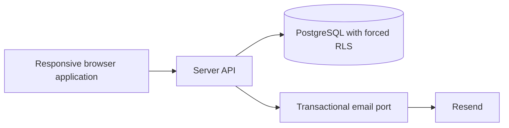

# Assessment Architecture

## 1. Purpose and authority

This document is the implementation architecture for the technical assessment. It intentionally covers only the executable assessment slice and is the architecture document candidates are expected to follow.

- [ASSESSMENT.md](../../ASSESSMENT.md) defines scope, priorities, deliverables, and completion rules.
- [SECURITY-INVARIANTS.md](SECURITY-INVARIANTS.md) defines the blocking security properties.
- [TARGET-ARCHITECTURE.md](TARGET-ARCHITECTURE.md) explains the broader future NOVA architecture. It is optional context and is **not** an implementation checklist for this assessment.

When the target architecture describes billing, AI, object storage, imports, exports, sector cockpits, production hosting, or other future components, candidates do not need to implement or scaffold them.

## 2. Required implementation shape

Build a modular web application with these required runtime components:

The prescribed baseline is:

- strict TypeScript;
- Next.js for the responsive web application;
- NestJS for the server API;
- PostgreSQL as the authoritative data store;
- Prisma for schema, migrations, and ordinary persistence access;
- reviewed SQL migrations for forced PostgreSQL row-level security;
- Resend behind a server-side transactional email adapter;
- Vitest, or an equivalent TypeScript test runner, for unit and integration tests;
- Playwright, or an equivalent browser runner, for end-to-end tests;
- repeatable local setup and continuous integration.

A deliberate deviation is acceptable when it preserves every functional requirement and security invariant and is explained in `SUBMISSION.md`.

## 3. Required module boundaries

The internal structure is the candidate's choice, but ownership must remain explicit. At minimum, the design must separate these responsibilities:

| Responsibility | Owns |
| --- | --- |
| Identity and authentication | credentials, login protection, password recovery, server-side sessions, secure Platform Administrator bootstrap |
| Platform administration | minimized Organization directory, provisioning, commercial state, access state, permitted interventions |
| Organization administration | Organization lifecycle, Companies, Business Scopes |
| Access control | memberships, invitations, profiles, capabilities, scope grants, suspension, ownership |
| Transactional email | allowlisted templates, delivery requests, Resend adapter, deterministic test adapter |
| Evidence | minimized records for sensitive administrative mutations |

Modules must not bypass each other's authorization or write rules. A modular monolith is sufficient; microservices are neither expected nor encouraged.

## 4. Mandatory architectural invariants

### Tenant isolation

- `Organization` is the only tenant boundary.
- Every tenant-owned row has a non-null `organization_id` resolved by the server.
- Authorization is enforced by the application and by forced PostgreSQL RLS.
- The runtime database identity cannot own protected tables or bypass RLS.
- Tenant-owned parent-child relationships are protected by Organization-aware database constraints.
- Missing, malformed, or stale tenant context fails closed.

### Authentication and authorization

- NOVA uses first-party email/password authentication and opaque server-side sessions.
- There is no public Organization self-registration and no MFA requirement.
- The browser is never authoritative for Organization, role, capability, ownership, or access state.
- Invitation and password-reset credentials are high-entropy, hashed at rest, single-use, expiring, and concurrency-safe.
- Suspension, removal, password reset, and permission reduction revoke affected access server-side.
- An active Organization keeps exactly one owner and at least one active Administrator.

The exact password, cookie, session, throttling, invitation, recovery, and email rules are blocking and are specified in [SECURITY-INVARIANTS.md](SECURITY-INVARIANTS.md).

### Transactions, concurrency, and evidence

- Multi-record lifecycle changes are atomic.
- Sensitive commands use an explicit concurrency strategy, such as row locking or optimistic versioning.
- Retried externally visible operations must not duplicate their business effect.
- Required administrative evidence is committed with the corresponding business mutation.
- The submission must prevent races such as accepting one invitation twice, losing the last Administrator, or committing a stale mutation after access revocation.

An outbox table is required when it is needed to make a submitted external side effect reliable. A queue, a dedicated worker process, Redis, and BullMQ are not independently required.

### API and web behavior

- Protected decisions are made server-side even when the UI hides unavailable actions.
- Inaccessible and nonexistent tenant resources return neutral external results.
- Persistent business state lives on the server and survives logout and login.
- Errors are safe and stable enough for clients and automated tests.
- Critical journeys are responsive from 360 px upward and keyboard-usable.

## 5. Required data and flows

The schema must support all required flows in [ASSESSMENT.md](../../ASSESSMENT.md), including:

- identities, password credentials, login protection, sessions, and password-reset tokens;
- Platform Administrator bootstrap;
- Organization provisioning and initial-owner invitation;
- Companies and Business Scopes;
- memberships, invitations, explicit capabilities, and Company/Business Scope grants;
- suspension, reactivation, and logical removal;
- advanced scoped Platform Administrator intervention and terminal Organization disablement;
- Administrator promotion and atomic ownership transfer;
- transactional email delivery state;
- evidence needed for sensitive foundation mutations.

Do not build speculative schemas for unrelated future product modules.

## 6. Email delivery

The three required message types are:

1. initial-owner invitation;
2. collaborator invitation;
3. password reset.

Production-style verification uses Resend and a real mailbox controlled by the candidate. The Loom demonstration shows receipt and completion of the invitation and password-reset journeys. Automated tests use the same outbound port with a deterministic recording adapter and do not send external email. Application callers cannot select arbitrary templates, markup, senders, or redirect origins.

The implementation may send email synchronously after a durable transaction or use an outbox/dispatcher. Whichever design is chosen must avoid losing committed invitations or exposing usable credentials, and must handle retries without duplicate business effects.

## 7. Required validation harness

The candidate is expected to build an executable harness that gives both the developer and the coding agent trustworthy feedback:

- unit tests for domain and permission invariants;
- integration tests against real PostgreSQL for migrations, constraints, authentication persistence, transactions, and forced RLS;
- negative cross-Organization tests, including reused pooled connections and forged identifiers;
- end-to-end tests for the principal required journeys;
- checks for stale access, replay, token expiry, concurrent invitation acceptance, and direct API authorization;
- linting, strict type checking, tests, and production build in CI;
- deterministic synthetic fixtures for at least two Organizations.

The complete blocking negative-test list remains in [SECURITY-INVARIANTS.md](SECURITY-INVARIANTS.md).

## 8. Optional implementation choices

These may be used when they improve the submitted solution, but they are not required by themselves:

- a separately runnable worker;
- Redis or BullMQ;
- a generated OpenAPI client;
- Docker or another container-based bootstrap;
- a formal ports-and-adapters folder structure;
- advanced observability beyond safe structured errors and useful correlation;
- real-time visual browser invalidation beyond required immediate server-side refusal;
- notification channels or templates beyond the three required transactional emails.

Candidates should prefer a smaller complete vertical slice over unused infrastructure or speculative abstractions.

## 9. Explicitly outside the assessment implementation

Do not implement or scaffold:

- billing or subscriptions;
- AI providers or copilots;
- sector KPI engines and cockpits;
- imports or real external connectors;
- object storage, exports, or consolidated reports;
- official immutable Audit versions;
- native mobile applications;
- microservices;
- externally delegated authentication;
- public Organization self-registration;
- production hosting topology.

These subjects appear only in [TARGET-ARCHITECTURE.md](TARGET-ARCHITECTURE.md) to explain how the assessed foundation could evolve.

## 10. Candidate architecture notes

In `SUBMISSION.md`, document:

- the implemented module boundaries and important transaction boundaries;
- deliberate deviations from the prescribed baseline;
- which optional components were used and why;
- optional enhancements that were implemented and why;
- known limitations, remaining risks, and the next implementation step.

Candidates do not need to reproduce the full target architecture or create speculative documentation for future NOVA modules.
