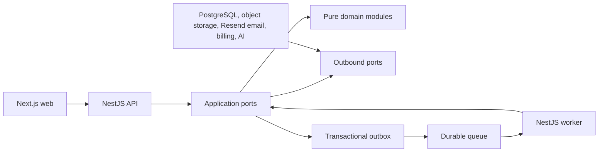
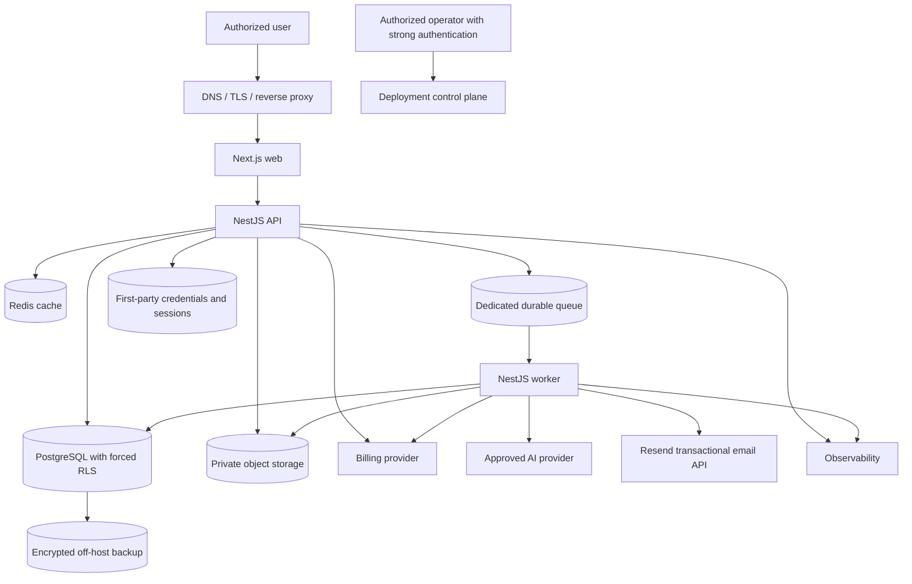

# NOVA Target Product Architecture

## 1. Purpose and assessment boundary

This document describes the complete target architecture for the fictional NOVA V1 product. It is optional context for candidates and is broader than the technical assessment so that foundation decisions do not block later product modules.

The concise [assessment architecture](ARCHITECTURE.md) is the implementation contract for the exercise. The decision identifiers in this document support traceability and deeper rationale; they do not turn the complete target topology into an implementation checklist. [ASSESSMENT.md](../../ASSESSMENT.md) remains the authority for delivery priorities.

The companion [SECURITY-INVARIANTS.md](SECURITY-INVARIANTS.md) is blocking for the assessment.

## 2. Architecture paradigm

NOVA is a **hexagonal modular monolith with a transactional outbox and asynchronous workers**.

- The web application, API, and worker are separately runnable processes in one repository.
- Each backend module owns its tables, invariants, commands, and public ports.
- Dependencies point from adapters to application services to pure domain logic.
- Synchronous cross-module interaction uses public ports. Deferred effects use versioned integration events.
- The modular monolith is the default until measured operational evidence justifies extracting a service.



## 3. Prescribed technology baseline

The assessment uses the following baseline unless a deviation is documented and justified:

- TypeScript with strict compiler settings;
- Next.js for the responsive web application;
- NestJS for API and worker processes;
- PostgreSQL as the authoritative database;
- Prisma for schema, migrations, and ordinary persistence access;
- PostgreSQL row-level security implemented through reviewed SQL migrations;
- Redis and BullMQ when asynchronous processing is implemented;
- S3-compatible private object storage for future files and exports;
- OpenAPI generated from server DTOs and a generated web client;
- Vitest for unit and integration tests;
- Playwright for end-to-end tests;
- Resend for required transactional authentication email through a server-side adapter;
- a reproducible container-based local environment and CI.

NOVA owns authentication. The assessment implements first-party email/password credentials and opaque server-side sessions. Externally delegated authentication is not part of the target model.

## 4. Architecture decisions

### AD-01 — One tenant boundary — Assessment

`Organization` is the sole technical and commercial tenant. Every tenant-owned object has a non-null `organization_id` generated or resolved by the server. `Company` and `BusinessScope` are never tenants.

### AD-02 — Server-calculated effective access — Assessment

Every protected request calculates access from active identity, active Organization, membership, Organization profile, explicit capability grants, assigned Companies/scopes, product entitlements where applicable, and the absence of a suspension. No browser claim is access authority.

### AD-03 — Tenant defense in depth — Assessment

API and worker use one `TenantDbSession`: begin a transaction, set a server-resolved tenant context locally, perform work, and finish the transaction. Missing or malformed context fails before tenant-owned access. Runtime exposes no unrestricted Prisma client.

Every tenant-owned table enables and forces PostgreSQL RLS with read and write policies based on the local tenant context. Runtime does not own tables and has neither `BYPASSRLS` nor role escalation. Migration, runtime, backup, and observability identities are distinct.

CI inventories tables, policies, views, functions, commands, and composite relations. Negative tests include Organization A → B → A context reuse on one pooled connection and missing context.

### AD-04 — Exclusive module ownership — Assessment

A module alone owns its tables and write rules. Other modules use a public port or versioned event and do not import internal repositories. Cross-module foreign keys are denied by default. The initial allowlist is limited to tenant-safe Organization, Company, and Business Scope references using composite tenant keys.

### AD-05 — Commands, transactions, and outbox — Assessment

Every mutation is an authorized application command. Domain state, optimistic version, required evidence, domain/integration event, and outbox record are committed atomically. Nothing is published to a queue before commit.

### AD-06 — Explicit concurrency and idempotency — Assessment

External commands and jobs use stable idempotency keys. Mutable aggregates use optimistic versions or deliberate row locking. Consumers record an inbox identity and result before acknowledgement. Replays have one observable effect; stale events do not regress state; missing versions retry and eventually dead-letter.

### AD-07 — Source-independent canonical model — Context

Cockpits, rules, alerts, AI, and exports consume versioned canonical facts rather than manual/import/provider formats. A canonical fact carries tenant hierarchy, typed period/value/unit, monetary semantics when relevant, data status, provenance, mapping version, optimistic version, and optional supersession. `null` is never zero.

### AD-08 — One ingestion pipeline — Context

Manual entry, imports, and future connectors follow receive → private staging → parse/map → validate → preview → explicit decision → atomic canonical write → targeted recalculation. Blocking errors write no canonical data. Warnings and duplicates require an explicit decision.

### AD-09 — Exact financial and temporal semantics — Context

Amounts use decimal storage, never binary floating point. Currency, tax basis, unit, period, flow/stock/ratio nature, and actual/estimated/forecast status are explicit. UTC timestamps and date-only business dates remain distinct. Comparisons require compatible semantics.

### AD-10 — Deterministic versioned rule engine — Context

Each important formula, threshold, score, alert, and ranking rule is a pure versioned function with typed inputs, units, period meaning, boundaries, and executable reference cases. Only validated parameters are stored; executable code is not entered through product configuration.

### AD-11 — Targeted recalculation and reproducibility — Context

A dependency catalogue maps data → rule → result. Valid changes invalidate only dependent results. Each calculation run records canonical input hash, data/rule versions, and output so identical inputs and versions reproduce identical results.

### AD-12 — Separate facts, recommendations, and AI — Context

The rule engine produces facts, KPI, alerts, contributions, reliability, and deterministic ordering. AI receives a minimal authorized package of already calculated facts and may explain or recommend through a validated schema. It cannot create authoritative numbers or execute actions.

### AD-13 — AI provider port and minimal evidence — Context

An `AiProvider` port isolates model, region, retention, and invocation. The server constructs authorized payloads and validates structured output. Persistence contains only permitted identifiers, versions, parameters, fingerprints, and useful output—never secrets or internal model reasoning.

### AD-14 — Mutable Work, immutable Audit — Context

Work Versions are mutable under access rules. Officialization creates a self-contained Audit snapshot with canonical ordering, data and rule versions, reservations, lineage, and integrity fingerprint. Runtime cannot update or delete retained Audit data. Correction creates linked new Work and Audit Versions.

### AD-15 — Business evidence is not observability — Assessment foundation

Identity, Organization, and platform mutations append minimized server-side evidence in the same PostgreSQL transaction as the mutation and outbox. Release 3 expands this into complete Audit evidence. Business Event IDs, integration Event IDs, domain Trace IDs, and technical correlation IDs remain distinct. Ordinary reads do not pollute the business ledger.

### AD-16 — Billing is webhook-authoritative — Context

Checkout and portal sessions are server-created. Verified webhook handling reloads authoritative provider objects, deduplicates events, projects current state, writes entitlements and outbox atomically, and periodically reconciles drift. Browser redirects never grant access. Billing recovery clears only billing suspension.

### AD-17 — Versioned internal entitlements — Context

Billing projects provider products, prices, and items into a local versioned entitlement snapshot. Access checks use this projection, not commercial labels or a provider call on every request. Archived offers remain valid references for existing subscriptions.

### AD-18 — Minimal, reauthorized asynchronous messages — Context

Messages contain opaque IDs, type/schema version, Organization, optional aggregate/version, causation, correlation, time, and idempotency key—not business payloads. Workers reauthorize before execution and before delivery. Each type defines bounded retries, timeout, idempotent external effects, and dead-letter handling.

### AD-19 — Private mediated files — Context

Files use encrypted private object storage with environment and Organization prefixes. Every download is reauthorized against current state. Long-lived bearer URLs are forbidden. Upload URLs may be short-lived and server-keyed. Export artifacts expire after seven days and purge includes staging and derivatives.

### AD-20 — Versioned API contracts — Assessment

Business HTTP APIs live under `/api/v1`. Validated server DTOs are authoritative; OpenAPI and the web client are generated. Errors follow `application/problem+json` with stable `code`, technical `correlation_id`, and safe field errors. Jobs, imports, exports, and events carry `schema_version`.

### AD-21 — Cache is derived, never authoritative — Context

Redis owns no durable business truth. Tenant keys include Organization and contract version. Authorization occurs before cache access, mutations invalidate by event, and critical suspension/entitlement checks use authoritative state or demonstrably immediate invalidation.

### AD-22 — Environment and secret isolation — Assessment

Local, development, test, staging, and production use separated configuration and resources. Production data is not copied to lower environments. Secrets come from environment/secret management and workload identity is preferred to static keys.

### AD-23 — Correlated minimized observability — Assessment

API and worker propagate a technical correlation ID. Structured logs exclude secrets, invitation tokens, full prompts, files, and customer business payloads. Traces and metrics measure errors, latency, queues, imports, exports, billing webhooks, and AI without becoming business evidence.

### AD-24 — Compatible deployment and migrations — Assessment

Database change follows expand → migrate/backfill → contract. Web, API, and worker share one release manifest and compatible contract window. Deployment checks health, migrations, tenant tests, and smoke tests before promotion. Application rollback never attempts a destructive database rollback.

### AD-25 — Extract services only with evidence — Context

A module may become a separate service only after measured need such as independent scaling, isolation, ownership, or deployment cadence. Before extraction, its public port, events, data ownership, idempotency, and failure behavior must already be explicit.

### AD-26 — Platform control plane without tenant bypass — Assessment

Platform administration owns minimized Organization lifecycle and support metadata. A targeted customer intervention opens exactly one audited Organization-scoped transaction through the same tenant protections as customer administration. Platform listing cannot enumerate customer business content.

### AD-27 — Tenant-safe relational integrity — Assessment

Tenant-owned unique constraints and parent-child references include `organization_id`. Composite foreign keys reject cross-Organization relationships even if an application filter is missing. The database—not only application code—enforces ownership, invitation, and lifecycle uniqueness where representable.

### AD-28 — Orchestrated retention and complete recovery — Context

Access end creates an authoritative retention schedule. Active data, object storage, exports, conversations, and backups follow their explicit deadlines. Restores reapply tombstones and overdue deletion schedules before customer access. Legal or billing evidence uses separate minimal retention policies.

### AD-29 — Queue Redis is isolated from cache Redis — Context

Durable queue state is not mixed with disposable application cache behavior. Queue configuration, persistence, eviction, monitoring, recovery, and backup assumptions are qualified for BullMQ separately from cache configuration.

### AD-30 — Ownership registry and authority map — Assessment

The repository documents each module's tables, commands, emitted/consumed events, and public ports. One authority exists for Organization ownership, membership, capabilities, billing state, rule versions, and Audit versions. Duplicate writable projections are forbidden.

### AD-31 — Web context and open-session revocation — Assessment

The browser stores selected context only as navigation state. Server responses include immutable Organization/Company/scope keys and an access epoch. Context switches cancel or ignore late responses and clear dependent cached state. Suspension or permission reduction increments the epoch; stale mutations fail without partial effect.

### AD-32 — Two-branch Work/Audit state machine — Context

Work remains mutable; readiness is a review signal; officialization creates immutable Audit. Correction branches from an Audit into a new linked Work Version instead of reopening history. State transitions, roles, and side effects are explicit commands.

### AD-33 — Billing catalogue, metrics, and notifications — Context

Offer configuration owns publication state, recurring price metadata, setup fees, trials, promotions, and provider mappings. Billing metrics are derived from authoritative local projections. Notifications are created through an outbox, deduplicated, role-minimized, and never replace provider invoices or receipts.

### AD-34 — Consolidated export preflight — Context

Before consolidated generation, the server resolves rights, scope, period, definitions, units, currency/basis, and rule versions. The user confirms the included items and explicit exclusions. The generated artifact is bound to that immutable preflight snapshot.

### AD-35 — Shared capability and scope vocabulary — Assessment

`CapabilityCatalog.v1` defines stable read/manage/sensitive capabilities and allowed scope types. Presets resolve to explicit grants but never create implicit permissions. Unknown, inactive, platform-only, or wrong-scope capabilities fail closed across API, worker, and UI.

### AD-36 — Messaging identity and ownership — Assessment foundation

Outbox messages have server-generated IDs, type/schema version, aggregate identity/version, tenant, causation, correlation, and idempotency. The producing module owns the event contract; consumers own their inbox and side effects. Personally identifying or business payloads are minimized.

### AD-37 — Audit evidence envelope — Assessment foundation

Sensitive mutations append a versioned evidence envelope containing actor, authoritative tenant context, action, object, server time, reason, minimized before/after, result, and correlation. Release 3 adds full domain lineage and Trace IDs without changing the envelope's trust boundary.

### AD-38 — One convergence path for access end — Context

Administrative disablement, billing end, user removal, and security suspension remain distinct causes but converge through one effective-access calculation, session invalidation, job cancellation/reauthorization, notification policy, and retention scheduler. One cause cannot clear another.

### AD-39 — Reconstructible infrastructure — Context

Target hosting is reproducible from versioned configuration, migrations, secret references, health checks, backup/restore procedures, and operational runbooks. Manual server state is not an undocumented dependency.

### AD-40 — Atomic Administrator and ownership lifecycle — Assessment

An active Organization has exactly one owner and at least one active Administrator. Promotion and ownership transfer are distinct. Transfer uses a pending proposal and serialized acceptance, rechecks proposer ownership and successor eligibility, invalidates stale proposals, and leaves the former owner as Administrator.

### AD-41 — Concurrent revocation through access epoch — Assessment

Membership and effective access carry a monotonically increasing epoch/version. Protected mutations compare the epoch inside their transaction before commit. Suspension, removal, Organization suspension, and permission reduction advance it so an in-flight stale command has no business effect.

### AD-42 — Identity bootstrap boundary — Assessment

`identity` owns credentials, login attempts, password-recovery tokens, and sessions for an immutable internal identity. Passwords use Argon2id with a unique salt and at least `m=19456 KiB`, `t=2`, `p=1`; parameters are encoded with each hash for future rehash-on-login upgrades. Passwords are at least 15 Unicode characters, allow at least 64, use no composition rule or scheduled rotation, and are rejected when present in the configured weak/compromised-password blocklist.

The first Platform Administrator is created through an idempotent one-time CLI/bootstrap command that reads an email and initial secret from non-committed secret input, refuses to overwrite an existing bootstrap, and requires password replacement at first login. No production default credential or development login route exists.

Customer identity creation requires a valid initial-owner or collaborator invitation. There is no public Organization self-registration. For a new identity, possession of the mailbox-delivered invitation proves control of the invited address; acceptance validates and hashes the chosen password and atomically consumes the invitation, creates the identity, membership, and required ownership when applicable. An existing identity must authenticate first and its normalized email must match before the invitation can be consumed.

Successful login creates an opaque cryptographically random session identifier with at least 128 bits of entropy. Only its hash is persisted; only the raw identifier enters a `__Host-nova_session` cookie with `Secure`, `HttpOnly`, `SameSite=Strict`, and `Path=/`. Browser traffic keeps web and API same-origin. Authentication secrets never enter browser local or session storage.

Sessions use a 30-minute inactivity limit, a 12-hour absolute limit, and a 10-minute recent-authentication window for sensitive operations. The identifier rotates after authentication, password change/reset, and privilege elevation. Logout, expiry, password reset, membership suspension/removal, Organization suspension, and security revocation invalidate affected sessions server-side. Cookie-authenticated unsafe methods also require CSRF protection.

Login and password-recovery responses are neutral for unknown, disabled, locked, or invalid identities and avoid timing shortcuts. Progressive throttling uses both normalized account and source buckets. Recovery tokens contain at least 128 bits of entropy, are stored only as hashes, expire after 30 minutes, are single-use, and are invalidated when replaced or consumed. A successful reset revokes every active session for the identity.

Security baseline: [NIST SP 800-63B password requirements](https://pages.nist.gov/800-63-4/sp800-63b.html), [OWASP Password Storage](https://cheatsheetseries.owasp.org/cheatsheets/Password_Storage_Cheat_Sheet.html), [OWASP Authentication](https://cheatsheetseries.owasp.org/cheatsheets/Authentication_Cheat_Sheet.html), and [OWASP Session Management](https://cheatsheetseries.owasp.org/cheatsheets/Session_Management_Cheat_Sheet.html).

### AD-43 — Runtime segmentation and root of trust — Context

Public edge, web, API, worker, database, queue, and object storage use least-privilege network and workload identities. Administrative access is separate, attributable, and not shared with application runtime. Compromise of one process should not automatically grant migration, backup, or host authority.

### AD-44 — Deployment control plane — Context

The preferred deployment control plane manages build, environment references, health checks, release promotion, and rollback while the repository remains the source for application and infrastructure configuration. Direct undocumented production edits are prohibited.

### AD-45 — Supply chain and resource policy — Assessment foundation

Dependencies are locked and scanned; builds are reproducible; container images run without root where practical; CI has least privilege; runtime CPU/memory and health limits are declared; generated artifacts are traceable to a commit and release identifier.

### AD-46 — Resend transactional email adapter — Assessment

Initial-owner invitations, collaborator invitations, and password resets are real transactional emails sent through Resend. The notifications module owns versioned templates and accepts only these named message types with schema-validated variables; callers cannot provide arbitrary HTML, sender, subject, or redirect origin. The sender and public application origin are allowlisted server configuration, and the candidate configures a verified sender or domain in a free Resend account.

The API commits the invitation or recovery record and its notification intent atomically. A dispatcher submits a stable delivery ID through the server-side Resend adapter and deduplicates by that ID. The Resend API key is injected outside the repository and is never exposed to the browser. Delivery uses bounded retries and records status, attempt time, safe failure code, and provider message ID without recording the URL or secret.

The authoritative invitation or recovery credential is stored only as a hash. Because an email system must temporarily carry the usable link, the outbox may hold only a short-lived, application-encrypted delivery envelope whose key is external to the database; it is deleted after accepted delivery or terminal expiry. The raw secret exists only in process memory or inside that encrypted envelope and is never logged, included in evidence, or returned by an administrative API. Resending invalidates the previous credential and creates a new delivery ID.

Automated tests use the same outbound port with a deterministic recording adapter. Completion additionally requires real Resend delivery to a mailbox controlled by the candidate, demonstrated through the invitation and password-reset journeys in Loom; production-style journeys must not rely on console output, a development inbox, or manual token copying.

## 5. Module ownership

| Module | Owns | Assessment status |
| --- | --- | --- |
| `identity` | internal identities, Argon2id credentials, login throttling, recovery tokens, server-side sessions, recent-auth state, secure bootstrap | Required |
| `platform` | Platform Administrator capability, minimized Organization directory, targeted interventions | Required |
| `organizations` | Organization lifecycle, commercial status, Companies, Business Scopes | Required |
| `access` | memberships, invitations, profiles, capability grants, scopes, suspensions, ownership | Required |
| `audit-foundation` | append-only evidence envelope for sensitive foundation mutations | Required |
| `notifications` | notification intent/outbox, encrypted delivery envelope, delivery state, and Resend adapter | Required for authentication email |
| `data-ingestion` | canonical facts, manual entry, import staging and mapping | Context |
| `rules` | formula/threshold catalogue, calculations, reliability, alerts | Context |
| `cockpits` | sector projections and authorized steering views | Context |
| `work-audit` | Work/Audit versions, officialization, lineage | Context |
| `exports` | simple and consolidated exports, report generation | Context |
| `ai` | proactive explanations and conversational copilot ports | Context |
| `billing` | offers, provider mappings, subscription projection, entitlements | Context |

## 6. Logical assessment data model

At minimum, the assessment should model:

- `Identity`
- `PasswordCredential`
- `AuthSession`
- `PasswordResetToken`
- `AuthenticationThrottle`
- `PlatformPrincipal`
- `Organization`
- `Company`
- `BusinessScope`
- `Membership`
- `OrganizationOwnership`
- `Invitation`
- `CapabilityDefinition`
- `PermissionPresetVersion`
- `CapabilityGrant`
- `CompanyGrant`
- `BusinessScopeGrant`
- `Suspension`
- `OwnershipTransferProposal`
- `AuditEvidence`
- `OutboxMessage`
- `EmailDelivery`
- `InboxReceipt` when a consumer exists

Tenant-owned relations include `organization_id` in their primary/unique relationship paths. A customer identity has at most one Organization membership in this assessment. Invitation token hashes, normalized email uniqueness, one active ownership assignment, duplicate-aware Business Scope identity, and command idempotency are database-backed invariants where practical.

## 7. Tenant session contract

Conceptually, tenant-owned work executes as:

```text
BEGIN
SET LOCAL app.organization_id = <server-resolved Organization ID>
SET LOCAL app.actor_id = <server-resolved internal identity ID>
SET LOCAL app.access_epoch = <current effective-access epoch>
execute authorized repository operations
append required evidence and outbox records
recheck access epoch for sensitive mutation
COMMIT
```

The exact database mechanism may differ, but it must prove:

- no raw unrestricted runtime database access escapes the adapter;
- missing context fails closed;
- `USING` and `WITH CHECK` policies cover read and write;
- runtime cannot bypass or own RLS-protected tables;
- connection-pool reuse cannot leak tenant context;
- cross-tenant composite references fail at the database boundary.

## 8. Commands and transaction boundaries

Commands are named business operations such as:

- `BootstrapPlatformAdministrator`
- `AuthenticateWithPassword`
- `LogoutSession`
- `RequestPasswordReset`
- `CompletePasswordReset`
- `ProvisionOrganization`
- `AcceptInitialOwnerInvitation`
- `ChangeOrganizationAccessState`
- `ChangeCommercialStatus`
- `CreateCompany`
- `CreateBusinessScope`
- `InviteCollaborator`
- `AcceptCollaboratorInvitation`
- `ChangeCollaboratorAccess`
- `PromoteAdministrator`
- `ProposeOwnershipTransfer`
- `AcceptOwnershipTransfer`

Each command defines actor, authoritative context, required capability, recent-auth requirement, input validation, idempotency, concurrency strategy, data changes, evidence, events, safe errors, and tests. Sensitive multi-record invariants are enforced in one transaction.

## 9. Web and API behavior

- The web client never sends a trusted Organization, profile, capability, ownership, or access-epoch claim.
- The API returns safe stable codes and a technical correlation ID.
- Inaccessible and nonexistent tenant-owned resources have a neutral external result.
- Late responses from an old selected context are ignored.
- Successful sensitive mutations return the new aggregate and access versions.
- Lists use server-side search, filtering, ordering, and pagination under current rights.
- No development login route, default password, or public Organization registration exists.

## 10. Testing contract

### Unit tests

Cover password policy and rehash decisions, neutral authentication outcomes, session expiry/rotation/revocation, recovery-token boundaries, throttling, email command validation, template allowlisting, untrusted sender/origin rejection, delivery idempotency, domain lifecycle transitions, permission resolution, scope descent, invitation time boundaries, preset resolution, last-Administrator protection, promotion eligibility, ownership proposal invalidation, access epoch behavior, and idempotency.

### PostgreSQL integration tests

Use a real PostgreSQL instance and prove credential/session/token constraints, hashed-secret persistence, bootstrap idempotency, migrations, forced RLS, missing context, A/B tenant reads and writes, search/count isolation, composite relationship rejection, same-connection A → B → A reuse, invitation races, duplicate Business Scope races, stale access mutations, and concurrent ownership transfer.

### End-to-end tests

Cover secure bootstrap, Platform Administrator login/logout, rejected login throttling, session expiry/revocation, password-reset request and completion through the recording email adapter, Organization provisioning, invitation-based initial-owner account activation and later login, collaborator activation and login, Company and Business Scope administration, permission change, suspension/reactivation/removal, Administrator promotion, ownership transfer, advanced scoped platform intervention, terminal Organization disablement, and at least one responsive critical journey. Separately demonstrate one real invitation and one real password-reset delivery through Resend to a candidate-controlled mailbox in Loom.

### Continuous integration

CI runs formatting/linting, type checks, unit tests, database migration from empty state, PostgreSQL integration tests, end-to-end tests, build, and dependency/security checks appropriate to the submission.

## 11. Target repository shape

```text
apps/
  web/
  api/
  worker/
packages/
  domain/
  contracts/
  database/
  test-support/
prisma/
  migrations/
docs/
.github/workflows/
```

Equivalent structures are acceptable when ownership remains clear and documented.

## 12. Consistency conventions

| Concern | Convention |
| --- | --- |
| Entities and tables | Singular English names in code, `snake_case` in PostgreSQL, server-generated sortable UUIDs, mandatory `organization_id` on tenant-owned data |
| Commands and events | Imperative commands such as `AcceptInvitation`; past-tense versioned events such as `InvitationAccepted.v1` |
| Time and numbers | RFC 3339 UTC instants, `YYYY-MM-DD` business dates, decimal strings at boundaries, explicit ISO currency and tax basis |
| HTTP API | `/api/v1`, JSON `snake_case`, cursor pagination, generated OpenAPI, `application/problem+json`, idempotency key for replayable exposed commands |
| State | Server-authoritative, optimistic `version`, no client-side success before server confirmation |
| Errors | Stable safe codes and correctable field detail; internal cause is correlated but not exposed |
| Configuration | Typed and validated at startup; secrets outside the repository; versioned business parameters are not environment variables |
| Logging | Structured JSON with default redaction and technical correlation IDs |
| Testing | Domain examples, module boundaries, real PostgreSQL/RLS integration, browser end-to-end, negative tenant isolation, concurrency, and recovery |

## 13. Target topology



The target has isolated local, development, staging, and production environments. Staging is production-like. Production backups and restoration tests are separate from the application runtime.

## 14. Capability-to-module map

| Capability | Primary modules | Main decisions |
| --- | --- | --- |
| Organization, Company, Business Scope | `organizations` | AD-01, AD-04, AD-27, AD-30 |
| Identity, membership, permissions, ownership | `identity`, `access` | AD-02, AD-03, AD-35, AD-40–42 |
| Platform control plane | `platform` through narrow module ports | AD-02, AD-15, AD-26, AD-37 |
| Data entry, imports, future connectors | `data-ingestion` | AD-07–09, AD-18, AD-27 |
| KPI, thresholds, scores, alerts | `rules`, `cockpits` | AD-09–12 |
| Proactive AI and copilot | `ai` | AD-10–13, AD-18, AD-23 |
| Work and Audit | `work-audit` | AD-05, AD-10, AD-14–15, AD-32, AD-37 |
| Exports and reports | `exports` | AD-09–11, AD-18–20, AD-34 |
| Billing and commercial access | `billing` | AD-02, AD-05–06, AD-16–18, AD-33, AD-38 |
| Files | `exports` and object-storage adapter | AD-18–20, AD-28 |
| Notifications | `notifications`, `apps/worker` | AD-05–06, AD-18, AD-22–23, AD-36, AD-46 |
| Operations | infrastructure and observability adapters | AD-22–25, AD-39, AD-43–45 |

## 15. Deferred production choices

The following choices are intentionally not fixed by the assessment and must not be silently converted into product commitments:

- production AI provider/model, region, subprocessors, retention, and parameters;
- category-specific legal retention beyond the general product lifecycle;
- final physical CSV, JSON, and PDF schemas outside the assessed modules;
- commercial prices and commercial AI quotas;
- simultaneous multiple base subscriptions, which remain disabled without a versioned partial-suspension and retention model;
- high-availability topology beyond the initial validated deployment;
- extraction of any module into a microservice.

The candidate may document a preferred option and trade-offs but should not implement speculative production integrations.

## 16. Explicit architectural exclusions for the assessment

Do not build sector KPI engines, production AI, billing integration, official Audit Versions, consolidated reports, real external connectors, native mobile applications, a commercial CRM, microservices, externally delegated login, or public Organization self-registration. Do not weaken module boundaries or canonical contracts in a way that makes those future capabilities require a foundation rewrite.
